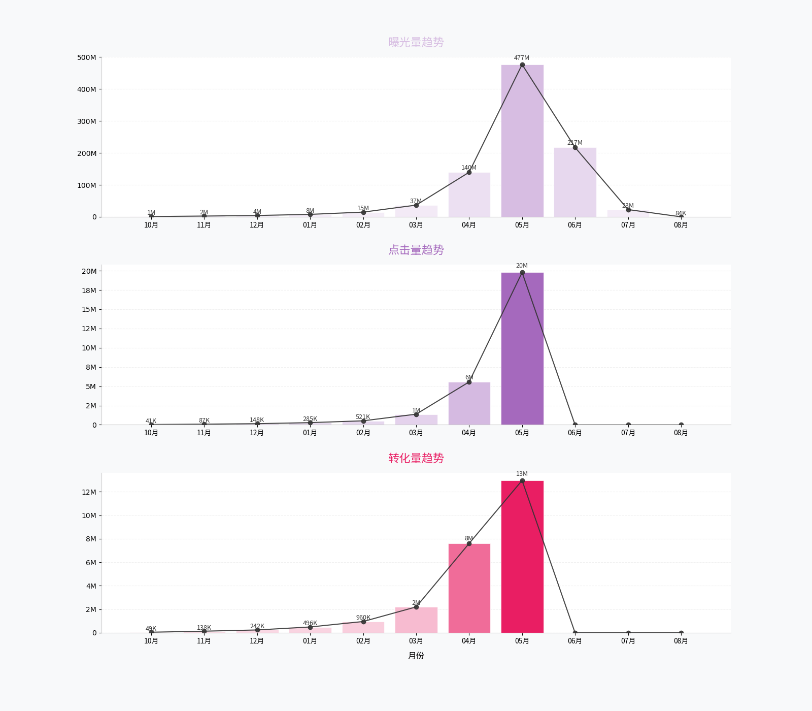
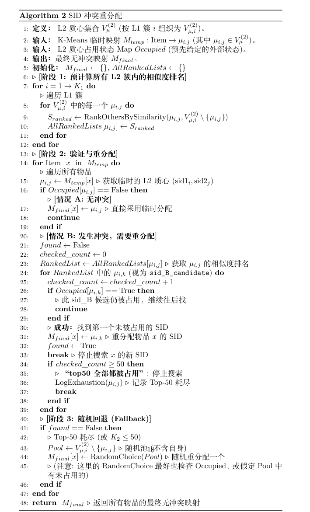
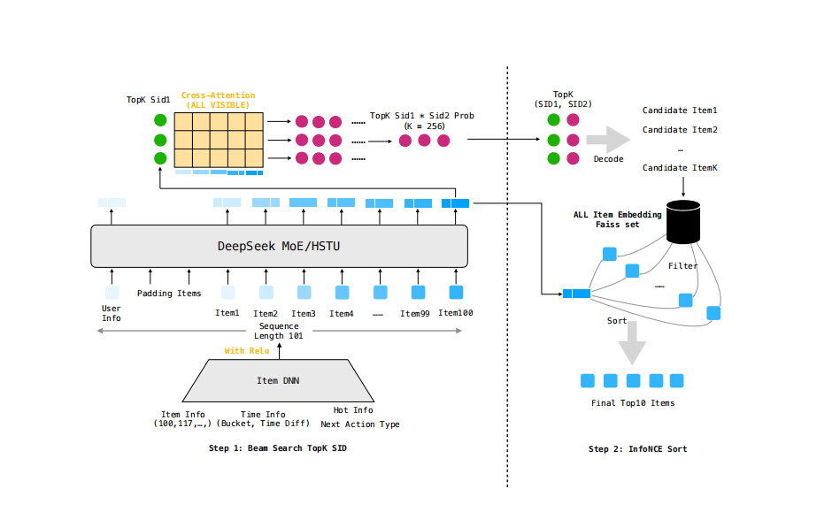
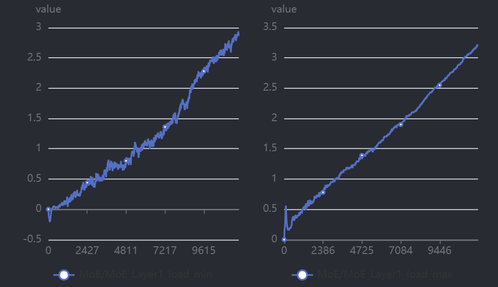
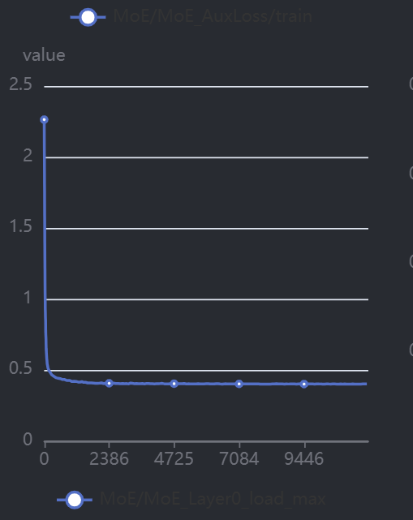

# OnePiece Technique Report
## 特征工程
心路历程（精简不看版）：
1. **Next Action Type特征**，由于复赛引入了点击、转换两种任务，因此我们在进入复赛后，首先进行了点击率和转换率的分析，但发现了一个奇怪现象，25年5月31日之后的交互只有曝光。因此我们设计了合理的Next Action Type提示机制。
2. **时间特征**，根据初赛的经验，引入相对时间特征是十分奏效的，但又有部分群友说绝对时间特征很重要，而我们一直没做work，因此我们开展了细致的时间特征验证。
3. **生命周期以及热度特征**，根据时间特征的观察，我们发现大量的Item只会在短时间内分发，同时往往是先大量而后逐渐衰减的形式，因此我们设计了曝光起止时间以及item的热度状态来让模型知道item的分发周期和分发状态。
4. **Semantic ID 特征**，询问了GPT老师以及群内沟通的生成式推荐的知识后，我们认识到SID是生成式推荐中不可或缺的，但81-86号mm_embedding发现缺失严重，不能对Item全集做到完全覆盖。因此我们将mm_embedding作为特征，在训练模型后利用itemdnn输出的item表征来指导Semantic ID的生成。

### **Next Action Type特征**
在复赛开始时，由于新引入了转换label，于是我们首先进行了`action_type`（即曝光、点击、转换）的探索性数据分析。我们首先发现了：1）点击率、转换率随着序列位置呈现先上升后下降的趋势，2）曝光率随着序列位置一直递增；这两种现象，如下图所示：

上述现象和我们初赛的分析不符，在初赛中，各个位置的点击率是稳定的，为了探明原因，我们进一步按时间维度进行action type的建模。如下图所示，我们发现了一个奇怪现象：25年5月31日之后的交互只有曝光！

可以看到，六月、七月、八月的action type行为永远是曝光，这种单一的模式可能会让模型认为在5月31日之后永远不可能发生点击或者转化，影响到PinRec的建模。于是我们在构造Next Action Type特征时，我们将所有PinRer的曝光行为都设置为Padding MASK，减少训练的bias，让模型专注于下一点击和转换的预测。通过消融实验，曝光mask在复赛中提供了大约千2的收益。

### **时间特征**
  初赛中，我们依靠相对时间涨了一次分，但引入绝对时间特征training loss下降显著，但是评估严重负向，很异常。但在小红书和比赛交流群里群友都说绝对时间有巨大收益，我们在复赛中进行了针对性的数据分析，通过分析相邻天的Item集合重复度，我们发现了**关键信息**，如下图所示：

  通过按月的形式将数据分片，之后我们计算任意两天（Day $i$, Day$j$）的活跃物品集合的相似度。我们采用 **Jaccard 相似度**作为度量指标：$$J(Day_i, Day_j) = \frac{|Items(Day_i) \cap Items(Day_j)|}{|Items(Day_i) \cup Items(Day_j)|}$$其中 $Items(Day_k)$ 是第 $k$ 天出现过的所有物品的集合。我们将这10个月的结果分别绘制成了热力图 (Heatmaps)。

  可以发现：**非对角线（$i \neq j$）上的所有值都持续处于极低的水平**，相隔一天之间的Jaccard相似度普遍 $< 0.3$，有些月份甚至在$0.1$以下。而相隔大于两天的Jaccard相似度普遍 $< 0.1$。这说明了数据集的一个关键特性：**Item是分阶段曝光的，且大部分Item只会在短期内有曝光！**，这让我们明确了绝对时间的重要性，但在复赛中，我们陷入了长时间的异常：即通过引入绝对时间特征，validation loss显著下降，但评估指标呈现负向。最终定位到BUG是因为我们引入了User Info的时间戳信息，导致存在严重的数据泄露。修复后，年、月、日形式的绝对时间特征大约贡献了千5的收益。

### **生命周期以及热度特征**
通过时间特征的分析，我们发现关键点：**Item是分阶段曝光的，且大部分Item只会在短期内有曝光！**，于是首先我们针对性的考虑引入Item的起止曝光时间点，帮助模型判断该Item的分发时间节点。在这个过程中，我们还进一步分析了Item的曝光模式：这里展示了数据集中"全局总曝光量"排名 Top 20的物品的曝光模式，结果如下图所示。

- 揭示了高热物品的三个普遍特性：
  1.  **瞬时性与脉冲式爆发**:所有物品的生命周期都极其短暂，呈现强烈的"脉冲"特性，突然上升。
  2.  **高度集中的爆发窗口**: 绝大多数曝光都集中在极少数的时间桶内。
  3.  **交错的峰值**:不同的物品（不同颜色）在完全不同的时间点上达到其曝光峰值。

更详细来说，我们从 Top 20物品中选取了`Item 7109103`作为典型样本进行了单独的可视化，结果如下图所示：

完美地印证了上述分析中的结论。我们可以清晰地观察到一个完整的生命周期模式：
- **爆发-峰值-衰减**: 该物品在绝对时间桶4000之前几乎不存在；随后曝光量迅速攀升，而后在绝对时间桶4500处达到峰值；最后缓慢衰减，在绝对时间桶6000后曝光消失。

这两张图共同揭示了一个现象：每个Item有它的生存周期，且一个单一的"Item全局热度"特征是具有高度误导性的。一个物品的全局曝光量很高，仅仅是因为它在"某个极短的时间内"被海量曝光过。因此，我们认为模型必须感知到"物品是在何时出现的"这一关键上下文信息。因此我们针对性地将绝对时间特征改造为分桶形式，之后通过桶内热度来更精准地判断Item的曝光状态。

### **Semantic ID 特征生成**
比赛期间，通过调研两种RQ-VAE以及RQ-Kmeans SID的构建方法，我们认识到一个稳定的Item 表征是构建SID的必要条件，但在给定的81-86号多模态embedding中，这些mm_embedding存在严重的**覆盖率不稳定**问题，甚至候选集中大部分物品都缺乏多模态向量。如果SID强依赖于mm_embedding，我们猜测在评测时性能会受很影响。

为了避免这个问题，我们采用mm_embedding作为特征，在模型收敛后，通过模型的item DNN embedding作为SID embdding的来源。之后我们通过RQ-Kmeans方法来进行SID的生成，但发现SID之间的冲突极其严重，初赛300万Item只有大约20万Item能独占SID。为此，我们设置了一个相似度排序逻辑为Item分配SID的策略，为每个物品定义其分层SID，并为其构建无冲突的语义ID。

该流程通过一个分层 K-Means 算法来定义 SID。
1.  **L1-SID (sid1)**: 算法首先在所有物品 Embedding 上运行 K-Means ($K_1$ 簇)，为每个物品分配一个粗粒度的 L1-SID。
2.  **L2-SID (sid2)**: 接着，在每个 L1 簇内部，算法再次运行 K-Means ( $K_2$ 簇)，为该簇内的物品分配一个细粒度的 L2-SID。
这个步骤的产出是 L1 和 L2的质心集合（$V_\mu^{(1)}, V_\mu^{(2)}$），以及每个物品到$(\text{sid1}, \text{sid2})$ 的映射。
#### 基于占用检查的 SID 冲突重分配
- 在`分层 SID 的生成`中通过分层 K-Means 获得的 $(\text{sid1}, \text{sid2})$映射，只是一个临时分配。在实际应用中（例如多任务学习或系统约束），某些L2-SID 可能是"被占用"(Occupied) 或因外部规则而无效的。
- 因此，我们必须引入一个冲突解决和重分配机制。该机制的目标是：验证每个物品的临时SID，如果其 $\text{sid2}$发生冲突（即被占用），则必须为其重新分配一个合法的、未被占用的新$\text{sid2}$。
#### 带约束的 SID 重分配机制
重分配流程遵循以下约束，以保持语义的连贯性：
1.  **"sid1固定" (L1 簇内重分配)**： 如果一个物品的临时 $\text{sid2}_j$(隶属于 $\text{sid1}_i$) 发生冲突，它的新 $\text{sid2}$必须从其同一个 L1 簇 $i$ 的兄弟节点中寻找。我们绝不跨 L1簇进行重分配。
2.  **"sid2相似度排序top50" (Top-50 搜索)**：为了最小化语义漂移，我们不随机分配。我们寻找与原始 L2 质心$\mu_{i,j}$（即 K-Means 分配的那个）余弦相似度最高的 Top-50 个兄弟L2质心，作为优先候选池。
3.  **"占用检查"与重分配**： 我们遍历 Top-50 候选列表，寻找第一个未被'Occupied'状态图标记的候选$\mu_{i,k}$。一旦找到，立即停止搜索，并将该物品的 L2-SID 重分配为$\text{sid2}_k$。
4.  **"随机回退" (Fallback)**： 如果 Top-50候选全部都被占用，搜索将停止。我们会启动回退机制：在 $\mu_{i,j}$*之外*的、同属 L1 簇 $i$ 的 $K_2-1$ 个节点中，随机选择一个（确保不与 $\mu_{i,j}$ 重复）作为其新的 L2-SID。通过这个完整的验证与重分配流程，我们确保了所有物品到$(\text{sid1}, \text{sid2})$ 的最终映射是无冲突且合法的。

我们在生成sid过程中尝试了使用mm_emb和模型生成的embedding这两种向量，其中mm_emb使用了83号，其使用top50解决冲突后，仍有700万的物品是没有唯一的sid，冲突率非常高。而使用模型生成的embedding之后，top50解决完冲突之后仅有20万。

## 分布式训练与推理
心路历程（精简不看版）：
1. **分布式训练**，复赛中，由于数据量激增，我们初赛的模型需要了5小时才能跑完1个epoch，严重阻碍了我们进行改动的验证。尝试后发现，虽然DeepSpeed加速框架无法使用，但是gpu-gpu,gpu-cpu之间的通信是没问题的，因此我们利用之前在联邦学习项目中学到的经验，设计了一个分布式训练框架来包装我们的模型，成功利用上多卡进行模型的训练。
2. **分布式推理**，在推理时，我们发现需要4小时以上才能得到评估结果，时间过长。但经过检查后，发现评测数据和训练数据的用户序列在特征基本上对齐，只有极少量数据不同。因此我们猜测只需要导出推理时的predict_set候选集就能利用上我们的分布式训练框架通过训练模式进行多卡推理，验证后发现确实能对齐模型评测指标。

### 分布式训练
- 在此次比赛的环境下，进程间TCP通信被禁用。标准的PyTorch多进程分布式训练框架（如DistributedDataParallel(DDP)）和高性能库（如Deepspeed）均无法使用。这些框架严重依赖底层的 `torch.distributed`包进行进程初始化（`init_process_group`）和跨节点通信，而这些操作通常基于TCP/IP协议栈。
- 当底层TCP通信被禁用时，进程间的"握手"和梯度交换（如AllReduce）完全失效。我们发现，即使是PyTorch内置的单进程多卡工具DataParallel(DP)，在某些环境的初始化阶段也可能尝试进行TCP探测，导致框架崩溃。因此，我们必须自行实现一个不依赖任何底层分布式通信原语的定制化多卡并行方案。
#### 解决方案: 采用单进程多线程的参数服务器（FedSGD）模式
我们设计并实现了一个自定义的数据并行框架（见`dataparallel.py`），其核心思想是"单进程、多线程、主卡聚合"。此架构在概念上与联邦学习（FederatedLearning）中的参数服务器（ParameterServer）架构（特别是FedSGD算法）高度相似，完全规避了TCP/PyTorch分布式通信的需求，仅通过内存和CUDA API进行数据交换。
- **架构核心：** 框架在单个Python进程中运行，该进程控制所有 $k$个可用的GPU设备。主线程（MainThread）负责数据加载、任务分发和最终的参数更新。
- **数据分发：** 在每个训练步骤中，主线程的 DataLoader一次性读取一个大小为 $B = k \times \texttt{bs}$ 的全局批次（GlobalBatch）。随后，通过 `_distribute_batch` 方法将 $B$沿批次维度（Dimension 0）精确切分为 $k$个子批次（micro-batch）$\{b_0, b_1, \dots, b_{k-1}\}$，其中 $b_i$的大小为 $\texttt{bs}$。
- **模型复制与角色定义：**
  - **模型初始化：** 框架在 `__init__`阶段，首先在主设备（`primary_device`，即 `device_ids[0]`，通常是`cuda:0`）上创建原始模型 $M_0$。
  - **模型复制：** 通过 `copy.deepcopy` 深度复制模型，为其他 $k-1$个设备分别创建一个完全独立的模型副本 $\{M_1, \dots, M_{k-1}\}$。每个$M_i$ 被移动到其对应的 `cuda:i` 设备上。
  - **角色分配：**
    - **主设备 ($d_0$ / `cuda:0`):** 扮演"参数服务器 (Server)"和"客户端(Client)"的双重角色。它负责：
      1. 执行 $b_0$ 的前向和后向传播；
      2. 作为梯度聚合的终点；
      3. 唯一执行优化器步骤（`optimizer.step()`）以更新其参数$\theta_0$；
      4. 将更新后的 $\theta_0$广播（Broadcast）到所有其他副本。
    - **从设备 ($d_i, i \ge 1$):** 仅扮演"客户端(Client)"角色。它们负责：(1) 接收来自 $d_0$ 的最新模型参数$\theta_i \leftarrow \theta_0$；(2) 执行各自子批次 $b_i$的前向和后向传播，计算梯度 $g_i$。

### 工作流程：算法描述
- 我们的训练流程由 `MyDataParallel` 模块和 `MyDataParallelOptimizer`包装器协同完成。关键点在于：
 1. 优化器 **仅** 在 `cuda:0`上创建，并只管理 $M_0$ 的参数；
 2. 梯度计算在所有GPU上并行发生；
 3. 梯度聚合和参数更新在 `cuda:0` 上串行发生；
 4. 更新后的参数被广播回所有副本。详细的训练步骤如算法所下所示。
#### 训练流程算法

该定制化框架不仅解决了TCP通信限制的核心问题，还集成了多项针对性的性能优化，这些优化在`dataparallel.py` 的实现中均有体现：
- **完全规避TCP/IP：** 最大的优势。通过单进程多线程和CUDA内存复制（`grad.to(device)`）实现梯度聚合，不依赖任何`torch.distributed` 或网络协议。
- **FedSGD式的更新效率：** 采用了参数服务器架构。
  - **单点更新：** 优化器 `step` 仅在 `cuda:0` 上执行一次。这避免了在$k$ 个GPU上维护 $k$ 份优化器状态（如Adam的动量 $m$ 和$v$），极大节省了显存。
  - **广播代替AllReduce：** 参数更新后，使用 `_sync_parameters` (本质是$k-1$ 次 `copy_`) 将新参数广播到其他设备。虽然这不如DDP的环状`AllReduce` 高效，但它在功能上是完备且健壮的。
- **异步数据传输：** 在 `_async_transfer_batch`中，数据向GPU的传输（`.to(device, non_blocking=True)`）被设置为异步执行。这使得数据从CPU到GPU的传输可以与前一个批次的GPU计算部分重叠，隐藏了数据传输的延迟。
- **计算与梯度传输的并行：** 每个GPU上的 `loss.backward()`是并行执行的。只有在所有卡都完成计算后，才开始串行地将 $k-1$个梯度复制到 `cuda:0`。
- **Python开销优化：**
  - **参数缓存：** `_cache_parameters`提前缓存了所有副本的参数列表，避免在 `_sync_gradients`中（这是一个高频操作）反复调用 `.parameters()`。
  - **结果缓存：** `_results_cache` 和 `_threads_cache`预先分配了列表空间，避免在每个 `forward`步骤中动态创建列表，减少了Python的内存分配开销。
- **稳健的同步机制：** 使用 `_all_devices_safe_check`在关键节点（如梯度聚合前）强制同步所有CUDA设备（`torch.cuda.synchronize(device_id)`），确保了计算的正确性，防止因CUDA异步执行导致的数据竞争或梯度读取错误。

### 分布式推理
#### 默认Infer效率瓶颈 (`infer.py`)
1. 在默认情况下，Angel机器学习平台每次仅为推理（Infer）任务分配单份计算资源。标准的推理入口（见`infer.py`）必须在此单资源上串行执行所有步骤：加载模型、读取完整的推理数据集（`predict_user.jsonl`）、生成全量候选库Embedding（`predict_set.jsonl`）、最后逐批为全量用户生成查询Embedding并计算Top-10推荐。
2. 经过我们的测试，这一套完整的串行过程（特别是候选库Embedding生成和全量用户-Item相似度矩阵计算）耗时预估超过3小时。这极大地延长了模型迭代的周期，成为了严重的效率瓶颈。
#### 核心洞察：训练与推理的数据一致性
我们通过分析发现两大关键事实：
1.  **缓存空间充足：** 训练资源提供了200G的`USER_CACHE_PATH`，足以持久化存储完整的候选库文件（`predict_set.jsonl`）。
2.  **数据来源一致：** 训练数据集（`seq.jsonl`）中的用户序列与推理集（`predict_user.jsonl`）中的用户序列完全一致。
- 这一发现使我们得以设计一套全新的"训练-推理" (Train-Infer)框架，利用训练阶段的 $k$张GPU资源来并行完成推理任务，将推理平台的任务极大简化。
#### 多卡"训练-推理"框架实现 (`train_infer.py`)
我们框架的核心思想是"分片并行、磁盘聚合" (Shard Parallelism, Disk Aggregation)。我们不再使用平台的Infer资源进行模型计算，而是利用训练(Train) 资源执行一个特殊的、并行的推理脚本（`train_infer.py`）。
- **数据并行划分：** 框架利用环境变量 `NUM_SHARDS` 和`SHARD_ID`，将全量用户（通过 `TrainInferDataset` 加载`seq.jsonl`）划分为 $k$ 个互斥的子集。$k$个并行的训练进程（每个进程绑定一块GPU）分别只处理各自的用户子集。
- **结果磁盘持久化：** 每个进程（Shard）将其负责的用户子集的推理结果（包含 `user_ids` 和`top10s`）序列化为 `part_{shard_id}.pkl` 文件，并存储于`$USER_CACHE_PATH/train_infer/{run_name}` 目录下。
- **秒级推理**：最终，我们提交到Angel平台的"真正"推理任务（`infer.py`）的角色被极大简化：它不执行任何模型计算。其`infer()` 函数通过 `wait_and_merge_results` 函数轮询 (Polling)检查上述磁盘路径，等待所有 $k$ 个 `part_.pkl`文件生成完毕，然后将它们合并并立即返回。
> 这种架构不仅实现了 $k$倍的推理加速（从3小时缩短至分钟级），还将每个模型的推理结果持久化到磁盘，为后续进行模型集成（Ensemble）（如`infer.py` 中实现的投票法）提供了极大便利。

#### 具体实现流程
该框架的完整工作流被拆分为三个解耦的阶段：
1.  **阶段1：模型训练**: 正常执行模型训练（`main_dist.py`），产出模型检查点（`model.pt`）。
2.  **阶段2：模型转存**: 启动一个特殊的"模型转存"任务。此任务通过设置`args.save_infer_model=True` 的 `infer.py` 脚本实现。
    - 此任务**仅**加载阶段1的检查点（`model.pt`），并立即将其重新保存到`$USER_CACHE_PATH/train_infer/{run_name}/model.pth`路径下。
    - **目的：** 此步骤是后续并行任务获取模型的唯一"信源" (Single Sourceof Truth)，将训练产物与推理环境解耦。
3.  **阶段3：并行推理**: 启动一个 $k$进程的**训练任务**（执行 `train_infer.py`），设置`NUM_SHARDS=`$k$。$k$ 个进程（Shard 0 到 $k-1$）并行执行以下操作：
    - **加载模型：** 所有进程从阶段2的 `model.pth`路径加载**相同**的模型参数到各自的GPU显存中。
    - **加载候选库：** 所有进程加载 `predict_set.jsonl`，并调用`get_all_candidate_embs_train`函数，在各自的GPU上生成一份**完整**的候选库Item Embedding张量$E_{\text{item}}$。
    - **数据分片：** 根据环境变量 `SHARD_ID`，每个进程实例化一个`TrainInferDataset` 的`torch.utils.data.Subset`，该子集仅包含总用户的 $1/k$。
    - **并行推理：** 每个进程迭代其用户子集（`DataLoader`），通过模型`predict` 方法批量生成用户查询Embedding $E_{\text{user}}$。
    - **计算与保存：** 在GPU上高效计算相似度$\text{Scores} = E_{\text{user}} \cdot E_{\text{item}}^T$，应用`infer_logq` 修正和历史行为过滤，并提取 `top-10`。最后，通过`_save_part` 函数将该分片的结果保存为 `part_{shard_id}.pkl`。
4. **阶段4：结果合并** 启动一个**最终的Infer任务**（`infer.py`，此时`save_infer_model=False`）。
    - 此任务的 `infer()` 函数进入 `wait_and_merge_results` 逻辑。
    - 它循环检测阶段3的输出目录，直到 $k$ 个 `part_.pkl` 文件全部生成。
    - 随后，它在主进程中将所有分片的结果（Python字典）合并，并将其作为最终答案返回给平台。

## 模型结构
我们的模型是一个端到端的（End-to-End）序列推荐框架。如下图所示，整体架构由四个核心组件构成：
1. 一个双路径 Item DNN 嵌入层；
2. 一个基于 MoE/HSTU 的深度序列编码器；
3. 一个自回归（Auto-Regressive）预测头。该模型有多种功能，Sid1 SoftmaxLoss和Sid2 Softmax Loss用来监督模型生成beam search所需的embedding；
4. InfoNCE loss with LogQ Debias用来监督模型训练排序能力

### 模型架构与定义
我们首先定义模型的核心组件。假设主序列编码器（例如 多层FlashAttention，HSTU 或 MoE）的输出为$H \in \mathbb{R}^{T \times D}$，即 $T$ 个时间步的上下文序列。
- **序列上下文 ($H$)**: $H$ 作为所有注意力机制的 Key 和 Value($K=V=H$)。
- **基础 Query ($q_0$)**: 我们取 $H$ 的最后一个时间步$h_T \in \mathbb{R}^D$ 作为预测的基础 Query。
- **SID 嵌入 ($W_{SID}$)**: $W_{SID} \in \mathbb{R}^{K \times D_{emb}}$是 $K$ 个 SID 的嵌入矩阵。
- **上下文聚合器 ($f_{\text{context}}$)**: 一个（例如HSTU）注意力模块，用于融合 Query 和上下文 $H$。
- **Query 融合层 ($f_{\text{query}}$)**: 一个线性投影层，用于融合基础Query $q_0$ 和 `Sid1` 的嵌入 $e_1$，以生成 `Sid2` 的 Query $q_2$。

### 训练阶段
在训练阶段，模型同时接收多种不同信号：
#### 预测 Sid1
$\text{Sid1}$ 的 logits $\mathcal{L}_1$ 通过基础 Query $q_0$ 聚合上下文$H$ 得到： $$\begin{align}c_1 &= f_{\text{context}}(Q=H, K=H, V=H) \\\mathcal{L}_1 &= \text{Projection}_{\text{sid1}}(c_1) \cdot W_{SID}^T \end{align}$$ 其损失 $L_{SID1}$ 为： $$\begin{equation}L_{SID1} = \text{CrossEntropy}(\mathcal{L}_1, y_{\text{sid1}})\end{equation}$$
#### 预测 Sid2
我们使用真实的 `Sid1` 标签 $y_{\text{sid1}}$ 来构建 `Sid2` 的 Query$q_2$： $$\begin{align}e_1 &= \text{Embedding}(y_{\text{sid1}}) \in \mathbb{R}^{D_{emb}} \\q_2 &= f_{\text{query}}(\text{Concat}(H, e_1)) \in \mathbb{R}^{D}\end{align}$$ 然后，使用 $q_2$ 聚合上下文 $H$ 来预测 `Sid2`：$$\begin{align}c_2 &= f_{\text{context}}(Q=q_2, K=H, V=H) \\ \mathcal{L}_2 &= \text{Projection}_{\text{sid2}}(c_2) \cdot W_{SID}^T\end{align}$$ 其损失 $L_{SID2}$ 为： $$\begin{equation}L_{SID2} = \text{CrossEntropy}(\mathcal{L}_2, y_{\text{sid2}})\end{equation}$$ 
#### InfoNCE
我们采用了在赛事讨论中非常关键的InfoNCE损失，对于一个Query$q_i$，其正样本为 $k_i^+$，负样本集 $\mathcal{K}_i^-$为该Batch内所有其他 $B-1$ 个用户的正样本 $\{k_j^+\}_{j \ne i}$。
    - **公式：** 损失函数（已应用Logq纠偏）定义为：$$L_{\text{InfoNCE}}(q_i, k_i^+) = - \log \frac{\exp(s(q_i, k_i^+) / \tau - \log q(k_i^+))}{\sum_{j=1}^{B} \exp(s(q_i, k_j) / \tau - \log q(k_j))}$$其中 $s(\cdot)$ 是相似度函数， $\tau$ 是温度系数， $\log q(k_j)$是Logq纠偏项。

综上，总损失$L_{\text{total}} = \alpha L_{SID1} + \beta L_{SID2} + L_{\text{InfoNCE}}(q_i, k_i^+)$ 。

### 流水线推理：SID Beam Search生成候选与InfoNCE双塔排序
我们的模型能够同时兼容SID Softmax和InfoNCE两种训练任务，在推理时这两个模块各司其职，协同进行Top10 Item的筛选。在推理阶段，我们采用 Beam Search 策略（Beam 宽度为 $B$）来寻找最大化联合概率 $P(\text{sid1}, \text{sid2})$ 的序列。
#### 阶段一：预测 Sid1 (Beam 初始化)
1. 我们首先计算 $\text{Sid1}$ 的对数概率$\text{log\_probs}_1 = \text{LogSoftmax}(\mathcal{L}_1)$。
2. 选取概率最高的 Top-B 个 SID 及其分数，作为 $B$ 个初始 Beam：$$\begin{equation}\text{Beams}_{\text{init}} = \{(s_{1,j}, \text{score}_j)\}_{j=1}^B\end{equation}$$ 其中 $s_{1,j}$ 是 $\text{Sid1}$索引，$\text{score}_j = \text{log\_probs}_1[s_{1,j}]$。
#### 阶段二：预测 Sid2 (Beam 扩展)
我们并行地为 $B$ 个 Beam 中的每一个 $j$ 生成 $\text{Sid2}$ 的预测。此时，我们使用阶段一预测出的 $\text{Sid1}$ $s_{1,j}$ 来构建 Query$q_2$： $$\begin{align}e_{1,j} &= \text{Embedding}(s_{1,j}) \\q_{2,j} &= f_{\text{query}}(\text{Concat}(q_0, e_{1,j}))\end{align}$$ 我们使用 $q_{2,j}$ 计算出该 Beam 对应的 $\text{Sid2}$的对数概率 $\text{log\_probs}_{2,j}$。

#### Beam Seach TopK （K=384）
为了找到最优序列，我们使用概率相加策略，计算 $B \times K$个候选序列的联合对数概率： $$\begin{equation}\text{Score}(s_{1,j}, s_k) = \underbrace{\text{score}_j}_{\log P(s_{1,j})} + \underbrace{\text{log\_probs}_{2,j}[s_k]}_{\log P(s_k | s_{1,j})}\end{equation}$$。最终的候选序列，是从所有组合中，联合对数概率$(\text{Score})$ 最高的 Top-K 个 $(\text{sid1}, \text{sid2})$ 序列，同时通过sid组合来反向解析出它的原本的Item集合，记作为$C_{\text{sid}}$。

#### InfoNCE Rank TopK (K=10)
1.  对于一个用户，我们计算其Query Embedding $q_u$。
2.  我们计算该 $q_u$ 与 **全量** 候选库 $E_{\text{item}}$ 的相似度$\text{Scores} = q_u \cdot E_{\text{item}}^T$。
3.  同时，我们不直接取Top-10，而是利用 $\text{Scores}$ SID Beam Search召回的候选集 $C_{\text{sid}}$ 进行重排序。
4.  最终，我们输出 $C_{\text{sid}}$ 中，按双塔模型相似度$\text{Scores}$ 排序最高的Top-10个Item。

### 模型升级改动（一）-特征-ItemDNN
- **移除User ID:** 考虑到UserID特征的稀疏性和巨大的内存开销，我们尝试直接去掉UserID特征。消融实验验证得到分数从 $0.112757$ 增长到$0.113612$，证实了此项优化的有效性。

- **Item ID哈希压缩:** 其次，我们对ItemID嵌入进行了哈希压缩。在我们的模型实现中，我们将原128维的ItemID嵌入（`item_emb`）降至32维，同时增加了两个哈希嵌入层（`item_hash_emb_a`和 `item_hash_emb_b`），其维度均为 $256$ (来自`args.hash_emb_size`)。第一个哈希词表大小为$2,000,003 + 1$，第二个哈希词表大小为 $3,000,017 + 1$。这样，我们就将Item ID相关的总嵌入缩小到 **约 $6.85 \text{ GB}$**。经过消融实验发现，使用hash item id后，分数从 $0.119837$ 提升到$0.122777$，效果显著。

- **非对称激活 (Asymmetric Activation):** 我们的双塔模型使用余弦相似度（或Dot Product）来衡量用户表征和Item表征的相关性。
  - **问题：** 用户表征（Query）经过了多层HSTU（含SiLU）或Transformer（含ReLU），其输出向量的值绝大多数为非负数。如果候选库Item（Key）的表征也按标准方式经过$\texttt{itemdnn} + \texttt{ReLU}$激活，那么Query和Key向量将同时变为非负向量。
  - **限制：** 这将导致余弦相似度的范围被严格限制在 $[0, 1]$区间，极大地削弱了模型的表征能力和对负样本的区分度。
  - **解决方案：** 我们在 `feat2emb` 函数中 实现了一个"非对称激活"机制。
    - **序列Item (带User融合):** 当处理训练序列中的Item时（`include_user=True`），模型在 `itemdnn`
      之后应用 `torch.relu` 激活函数，并与User表征相加。
    - **候选Item (独立Item):** 当处理候选库Item时（例如在
      `get_all_candidate_embs` 中调用时，`include_user=False`），模型在
      `itemdnn` 之后**不使用**激活函数，直接返回投影后的向量。
  - **收益：** 这种非对称处理（序列Item有ReLU，候选Item无ReLU）打破了$[0, 1]$ 的限制。消融实验证实，此操作使分数从 $0.0967114$ 增长到$0.0997224$，效果显著。

### 模型升级改动（二）-Seqence Encoder
这是我们生成式推荐的核心。在将嵌入投影到 $\texttt{hidden\_dim}$维度后，序列Embedding被送入一个深度编码器（Encoder）以捕捉序列依赖关系。我们在Baseline模型基础上，实现了HSTU、RoPE和DeepseekMoE三种架构。
#### **Baseline: 经典Transformer Encoder** 
Baseline采用了经典的TransformerEncoder架构，即堆叠 $\text{args.num\_blocks}$ 层的Transformer块。
- **架构:** 我们采用了 **Pre-LayerNorm (Pre-LN)** 架构，即在每个子层（MHA或FFN）之前应用层归一化。这相比Post-LN架构提供了更稳定的梯度，支持更深层的模型训练。
- **绝对位置编码:** 序列Embedding通过元素求和的方式，与一个可学习的绝对位置编码（`self.pos_emb`）相结合。
- **Flash MHA:** 注意力层使用了我们自定义的`FlashMultiHeadAttention`，它在PyTorch 2.0+环境下会自动调用`F.scaled_dot_product_attention`，利用FlashAttention的I/O感知算法减少内存读写，实现显著的训练加速。
- **FFN:** FFN层使用Point Wise Feedforward，使用Conv1d进行计算。为了适配后续的DeepseekMoE层，我们将其修改为了双线性层。
#### **改进1: HSTU (Hierarchical Sequential Transduction Unit)** 
针对生成式推荐任务，我们测试了HSTU架构，它使用一个统一的块替代了MHA和FFN。
- **结构:** HSTU 同样在Pre-LN 之后应用。其核心计算分为三步：
  1.  **逐点投影 (Pointwise Projection):** 输入 $X$首先通过一个大型线性层 `f1_linear`，并应用 $\phi_1$ (SiLU)激活，一次性生成四个中间张量：$U, Q_{proj}, K_{proj}, V_{proj} = \phi_1(\texttt{f1\_linear}(X))$。
  2.  **空间聚合 (Spatial Aggregation):** $Q, K, V$被重塑为多头形式。注意力分数计算为$\text{Scores} = \frac{Q K^T}{\sqrt{d_k}} + \text{RAB}$，其中$\text{RAB}$是一个可学习的相对位置偏置（`self.rel_pos_bias`），类似于T5。关键在于，HSTU使用第二次SiLU激活$\phi_2$替代Softmax：$\text{Weights} = \phi_2(\text{Scores})$。在应用掩码和Dropout后，计算出$\text{AttnOut} = \text{Weights} \cdot V$。
  3.  **逐点变换 (Pointwise Transformation):** 最终输出由 $U$门控（Gating）并由 `f2_linear`投影：$Y = \texttt{f2\_linear}(\text{AttnOut} \odot U)$。
- **收益:** 我们将Transformer替换为HSTU（并移除绝对位置编码），分数从$0.0731137$ 上涨到 $0.0755008$，且模型Scaling的收益更明显。
#### **改进2: RoPE (Rotary Position Embedding)**
作为绝对位置编码的替代方案，我们还实现了旋转位置编码（RoPE），仅在传统Transformer和MoE中使用，HSTU不使用。
- **机制:** RoPE是一种将相对位置信息集成到注意力计算中的精妙方法。它在$Q$ 和 $K$ 被投影到多头并分割到 $d_k$ 维之后 应用。
- **计算:** RoPE将 $d_k$ 维的特征向量视为 $d_k/2$个复数。对于处于绝对位置 $m$ 的token，其 $Q$ (或 $K$) 向量 $q_m$会乘以一个旋转矩阵 $R_m$。$R_m$ 的定义基于位置 $m$ 和一个预设的频率$\theta_i = 10000^{-2i/d_k}$。
- **实现:** 在实践中，这是通过将特征两两配对 $(x_j, x_{j+1})$ 并应用$x'_j = x_j \cos(m\theta_i) - x_{j+1} \sin(m\theta_i)$ 和$x'_{j+1} = x_j \sin(m\theta_i) + x_{j+1} \cos(m\theta_i)$来实现的。
- **优势:** 由于旋转矩阵的性质，最终的注意力分数$\langle q'_m, k'_n \rangle$ 仅依赖于相对位置 $(m-n)$和内容，实现了"平移不变性"，这在我们固定User位置的序列结构中表现尤为出色。在消融实验中，RoPE将分数从0.0763288提升到了0.0788524，效果显著。
#### **改进3: Deepseek MoE (Mixture of Experts)**
初赛时，我们不仅分离了Embedding层和DNN、Transformer内部隐藏层的维度，还将Transformer的FFN层隐藏层维度额外设置了一个倍率。具体而言，我们增加了一个参数$\text{feed\_forward\_hidden\_units}$，我们将FFN层的维度额外扩大，变为$\text{args.hidden\_units} \times \text{args.dnn\_hidden\_units} \times \text{feed\_forward\_hidden\_units}$(1024维)，得到了较大收益。受FFN层维度扩大带来收益的启发，我们引入了混合专家（MoE）架构。此架构在极大程度上增加参数量的同时，可以控制计算量在可接受范围内。
##### **Deepseek MoE结构** 
我们使用 `DeepseekMoEBlock`替代了传统Transformer块中的FFN层。该MoE块的结构为：$$\begin{aligned}X' & = \text{MHA}(\text{PreLN}(X)) + X \\Y & = \text{MoE}(\text{PreLN}(X')) + X'\end{aligned}$$ 其中 `MoE` 层由门控网络（Gating）、$N$个专家（Experts）和一个可选的共享专家（Shared Expert）组成。
##### **门控与路由**
门控网络 `MoEGate`负责决定每个Token $x_t$（来自$X \in \mathbb{R}^{T \times D}$）应由哪些专家处理。
  - **Gating Logits:** $L(x_t) = x_t \cdot W_g$，其中$W_g \in \mathbb{R}^{D \times N}$ 是可学习的门控权重。
  - **Gating Probabilities:** $P(x_t) = \text{Softmax}(L(x_t))$。
#####  **专家计算** 
每个专家 $E_i$是一个标准的FFN（SiLU激活）。共享专家 $E_s$ 也是一个标准FFN。$$E_i(x) = ( \text{SiLU}(x W_{1,i}^{\text{gate}}) \odot (x W_{1,i}^{\text{up}}) ) W_{2,i}$$门控系统根据路由策略选出 Top-K（例如 $K=3$）个专家$I_t = \{i_1, \dots, i_K\}$。 最终输出 $y_t$ 是 $K$个激活专家的输出与共享专家（如果启用）输出的加权和：$$y_t = \sum_{i \in I_t} w_i \cdot E_i(x_t) + E_s(x_t)$$ 其中$w_i$ 是 $P(x_t)_i$ 经过归一化（`norm_topk_prob=True`）后的权重。
##### **避免专家崩溃**
为防止门控网络将所有Token路由到少数"明星专家"，我们实现了两种负载均衡策略：
1. **策略1: 序列级辅助损失 (Sequence-level Aux Loss)**：我们仿照Deepseek的实现，在训练时引入辅助损失$L_{\text{aux}}$。
    - **负载比例 $C_{b,e}$:** 对于Batch中的序列 $b$，专家 $e$处理的Token比例，归一化后为$C_{b,e} = \frac{\text{count}(I_{b,s} = e)}{S \times K / N}$，其中$S$ 是序列长度。
    - **平均概率 $P_{b,e}$:** 专家 $e$ 在序列 $b$ 上的平均门控概率$P_{b,e} = \frac{1}{S} \sum_{s=1}^{S} P(x_{b,s})_e$。
    - **损失函数:** 损失$L_{\text{aux}} = \alpha \cdot \frac{1}{B} \sum_{b=1}^{B} \sum_{e=1}^{N} C_{b,e} \cdot P_{b,e}$。此损失同时惩罚了"高负载"和"高置信度"的组合，促使门控网络探索其他专家。
2.  **策略2: 无损失偏置均衡 (Loss-Free)** 我们也尝试了`LoadBalancingStrategy`。此方法不引入$L_{\text{aux}}$，而是为每个专家 $e$ 维护一个可学习的偏置$b_e$（初始为0）。
    - **路由:** 路由决策基于$P_{\text{route}}(x_t) = P(x_t) + \mathbf{b}$。
    - **加权:** 最终的加权求和 $y_t$ **仍使用**原始的$P(x_t)$，偏置 $\mathbf{b}$ 仅影响路由决策。
    - **偏置更新:** 偏置 $\mathbf{b}$在训练时更新。计算全局平均负载$\text{AvgLoad} = (T \times K) / N$。若专家 $e$ 的负载$\text{Load}_e < \text{AvgLoad}$，则增大 $b_e$，反之减小：$$\Delta b_e = \alpha_{\text{lb}} \cdot \text{sign}(\text{AvgLoad} - \text{Load}_e)$$
#####  **MoE均衡度测试**
我们使用专家负载的Gini系数（`_calculate_gini`）来量化均衡性（0为完美均衡，1为完全不均）
- **HSTU架构:** 将HSTU的 `f2_linear` 替换为MoE（64E-3K-1S）。AuxLoss (0.01) 导致Gini \> 0.8（崩溃）。Loss-Free (更新率0.02)虽使Gini \< 0.1，但导致严重掉分 (0.106385 $\to$ 0.0979128)。下图展示了Loss-Free情况下，第一层专家的Bias和Gini系数。

- **传统Transformer架构:** 使用Loss Free方式时，无论如何调整bias更新率，所有层的Gini系数都会在10%steps以内飙升到0.8以上。而Aux Loss(0.05) 使Gini稳定在0.1-0.3。但我们发现，Cosine学习率退火的最后阶段（Epoch6）会导致Gini"崩溃"（降至0.01-0.03），反而损害了性能（MoE 5epochs: 0.129969 $\to$ MoE 6 epochs:0.129287）。我们将训练延长至8Epochs以避免退火阶段的Gini崩溃，分数提升至 $0.130216$。下图展示了Aux Loss情况下，所有专家的Aux Loss收敛情况和第一层专家的Gini系数。

  
### 模型升级改动（三）-Loss Function
在训练过程中，我们对损失函数进行了多轮迭代。
1.  **InfoNCE损失：** 为解决BCE的缺陷，我们采用了在赛事讨论中非常关键的InfoNCE损失，感谢Ado大佬！
    - **定义：** InfoNCE将相似度检索视为一个多分类问题，其目标是从一个包含一个正样本和$N$ 个负样本的集合中准确地"辨认"出正样本。我们采用的是"In-BatchNegatives"策略：初赛时，使用整个Batch内所有用户的随机负样本拼接为一个大的负样本池；复赛时，对于一个Query$q_i$，其正样本为 $k_i^+$，负样本集 $\mathcal{K}_i^-$为该Batch内所有其他 $B-1$ 个用户的正样本 $\{k_j^+\}_{j \ne i}$。
    - **公式：** 损失函数（已应用Logq纠偏）定义为：$$L_{\text{InfoNCE}}(q_i, k_i^+) = - \log \frac{\exp(s(q_i, k_i^+) / \tau - \log q(k_i^+))}{\sum_{j=1}^{B} \exp(s(q_i, k_j) / \tau - \log q(k_j))}$$其中 $s(\cdot)$ 是相似度函数， $\tau$ 是温度系数， $\log q(k_j)$是Logq纠偏项。
    - **相似度函数：** 我们对比了点积（Dot Product）和余弦相似度（Cosine Similarity）。余弦相似度（通过`F.normalize`实现）的得分（$0.04296$）远高于点积（$0.0263922$），因此我们后续均采用余弦相似度。
    - **温度系数 $\tau$：** 我们尝试了可学习温度（`learnable_temp=True`），参数最终收敛到$0.02$ 附近，但得分低于固定温度。经过多轮消融实验，我们最终确定$\tau=0.02$ 为最佳温度。

#### **Logq纠偏 (Debiasing)：**
在我们的实现中，我们发现标准的InfoNCE是随机负采样的，但是我们发现大量Item只曝光过几次，这些Item反而会经常被采样到，导致模型的负样本太弱。于是我们考虑使用In-BatchNegatives策略，即直接使用Batch内其他序列的Item作为当前序列的负样本来增加任务难度。但是，In-BatchNegatives策略引入了一个严重的偏差：一个Item越"热门"（流行），它越有可能出现在一个Batch中成为负样本，导致模型过度惩罚热门Item，产生"流行度抑制"问题。
- **失败的纠偏尝试：** 我们对纠偏进行了大量探索，但多数效果不佳：
  1. 我们认为冷门Item的ID在Item IDEmbedding表中几乎是随机值，所以将出现次数 $< 10$ 的冷门ItemID合并，分数从 $0.0789$ 掉到 $0.0763$。
  2.  将"是否冷门"作为0/1特征加入Item Sparse，分数从 $0.08332$ 掉到 $0.08327$。
  3.  将In-Batch正样本与随机负样本混合拼接，得到一个超大负样本池，目的是打压热门Item，分数从$0.1056$ 掉到 $0.0723$。
- **Logq纠偏：** 我们最终采用了基于采样概率的Logq纠偏（即Sampled Softmax中使用的校正方法）。
  - **方法：** 如InfoNCE公式所示，我们在计算Softmax的logits时，从每个相似度$s(q_i, k_j) / \tau$ 中减去该Item的采样概率的对数值$\log q(k_j)$。该 $\log q(k_j)$ 值即为`pos_log_p`，在数据预处理时根据Item在训练集中出现的频率统计得出。
  - **关键实验：** 我们对比了在"In-Batch Negatives"（即去除随机负样本，只用Batch内其他正样本作为负样本）策略下，是否使用Logq纠偏：
    - **不使用Logq：** 纯粹的In-Batch（难）负样本训练导致模型崩溃，分数从 $0.0825$ 掉到
      $0.0378$。
    - **使用Logq：** 加入Logq纠偏后，模型效果飙升，分数从 $0.0378$上涨到 $0.0949$。

  - **结论：** 这一组对比实验强有力地证明了，难负样本的In-Batch Negatives策略必须与Logq纠偏同时使用，才能在克服流行度偏差的同时，享受难负样本带来的训练效率提升。

#### **优化器和稳定训练**
##### **稳定训练方法：** 
为确保深度序列模型（尤其是MoE和HSTU）的训练稳定性并避免过拟合，我们采用了一套组合策略：
- **Weight Decay (L2正则化):** 我们在优化器层面引入了 $L_2$正则化。该策略通过向损失函数添加一个与参数平方和成正比的惩罚项来限制模型复杂度。在我们的实验中，`weight_decay`系数固定为 $1 \times 10^{-5}$。
- **Warmup与Cosine Annealing:** 我们采用了"预热+余弦退火"的学习率调度策略（`use_cosine_annealing=True`）。
  1. **Warmup:**训练总步数（$\text{TotalSteps} = \text{Epochs} \times \text{BatchesPerEpoch}$）的前$10\%$ 被设为线性预热（Linear Warmup）阶段。在此阶段，学习率从一个极小值（$1 \times 10^{-8}$）线性增长至设定的基础学习率 $\texttt{args.lr}$。
  2. **Cosine Annealing:** 预热结束后，学习率在剩余的 $90\%$步数中，按照余弦函数曲线平滑下降至$\texttt{args.lr\_eta\_min}$（在我们的设置为 $0.0$）。此策略组合通过 `SequentialLR`实现，有助于模型在训练初期稳定渡过梯度剧烈波动的阶段，并在后期更精细地探索最优解。

##### **优化器：AdamW** 
我们使用 AdamW作为基础优化器。与传统Adam在计算梯度更新时才应用L2惩罚不同，AdamW将Weight Decay从梯度更新中解耦，直接在参数更新步骤中应用（$w_t \leftarrow w_{t-1} - \eta \lambda w_{t-1} - \dots$），这被证明在现代深度学习模型中更有效。
##### **优化器：Muon**
为探索更先进的优化策略，特别是针对大规模Transformer模型训练稳定性和超参数可迁移性的改进，我们引入并实现了Muon优化器。
- **实现细节 (`muon_update` 函数):** 我们的Muon优化器核心逻辑在`muon_update` 函数中实现，它结合了动量和 $\mu$P 特有的缩放技术：
  1.  **动量更新:** 首先，使用Nesterov动量更新动量缓存$\mathbf{m}$：$$\mathbf{m}_t = \beta \mathbf{m}_{t-1} + (1 - \beta) \mathbf{g}_t$$计算Nesterov更新方向$\mathbf{u}_t = (1+\beta)\mathbf{m}_t - \beta \mathbf{m}_{t-1}$（代码中简化为$\mathbf{u}_t = \mathbf{g}_t \cdot \text{lerp}(\mathbf{m}_t, \beta)$）。
  2.  **牛顿-舒尔茨迭代缩放 (`zeropower_via_newtonschulz5`):** 接下来，对更新方向 $\mathbf{u}_t$应用一个基于牛顿-舒尔茨迭代的函数。此迭代通常用于数值计算矩阵函数，如矩阵的逆平方根$X^{-1/2}$ 或正交化。我们的实现 `zeropower_via_newtonschulz5`进行了固定的5步迭代，其近似目标（旨在使更新更符合 $\mu$P的缩放要求。更新后的方向记为 $\mathbf{\tilde{u}}_t$。
  3.  **维度缩放：** 最后，根据参数梯度张量的形状（特别是最后两个维度$d_{\text{out}}, d_{\text{in}}$，对应于权重矩阵的输出和输入维度），应用一个缩放因子：$$s = \sqrt{\max(1, d_{\text{out}} / d_{\text{in}})}$$最终的更新方向为$\mathbf{\hat{u}}_t = \mathbf{\tilde{u}}_t \cdot s$。这个缩放因子是Muon 的关键组成部分，它确保了对于不同类型的层（如$d_{\text{out}} \gg d_{\text{in}}$ 或$d_{\text{in}} \gg d_{\text{out}}$），参数更新的尺度能正确地随模型宽度变化，从而保持训练动态稳定。

- **优化器步骤 (`SingleDeviceMuon.step`):** 在每个优化步骤中：
  - 调用 `muon_update` 计算最终的更新方向 $\mathbf{\hat{u}}_t$。
  - 应用解耦权重衰减：$w_t \leftarrow w_{t-1} (1 - \eta \lambda)$。
  - 更新参数：$w_t \leftarrow w_t - \eta \cdot \mathbf{\hat{u}}_t$。
- **混合优化策略:** 如前文所述，我们在 `MyDataParallelOptimizer`中采用了混合策略：
  - **Muon参数:** 仅对Transformer/HSTU/DNN块中的权重矩阵（即`ndim >= 2` 且名称匹配的非偏置项）使用 `SingleDeviceMuon`优化器，并为其配置独立的超参数 $\texttt{args.muon\_lr}$ (0.02)和 $\texttt{args.muon\_momentum}$ (0.95)。
  - **AdamW参数:**
    其他所有参数（Embedding、偏置、LayerNorm参数等）继续使用AdamW优化器。
- **实验结果：** 这种结合了AdamW的鲁棒性和$\mu$P对权重矩阵优化优势的混合策略，在我们的消融实验中表现出色，将分数从$0.118511$ 提升到了 $0.121122$。
## 评估策略
为进一步提升模型的在线推理（Infer）效果并优化评估流程，我们采用了以下关键策略：
### 历史行为过滤
- **动机:** 复赛直播中专家提到，对于点击的样本，会在历史序列中过滤掉这个点击样本的曝光；对于转化的样本，历史中同样会将对应的点击和转化过滤掉。此外，根据常识，用户很少会重复点击已交互过的广告。因此，在推荐列表中包含历史Item是无效且低效的。
- **实现:** 我们在推理脚本 (`infer.py` 和 `train_infer.py`)中实现了历史行为过滤。具体而言：
  1. 在生成用户Query Embedding的同时，记录下该用户历史序列 (`log_seqs`)中所有非Padding的Item ID (`creative_id`)。
  2. 构建一个从 `creative_id` 到其在候选库Embedding矩阵中行索引的映射(`creative_id_to_candidate_idx`)。
  3. 在计算完用户Query Embedding与 **全量** 候选库ItemEmbedding的相似度矩阵后，遍历用户的历史Item ID集合。
  4. 将这些历史Item ID在相似度矩阵中对应的得分设置为负无穷(`-torch.inf`)。

- **收益:** 这一过滤策略确保了推荐结果的新颖性，并且带来了极为显著的性能提升，得分从$0.105634$ 上升到 $0.11506$。
### 冷启动Item过滤
- **观察:** 我们统计发现，在初赛的候选库中，约有$148,971 / 659,988 \approx 22.6\%$的Item是冷启动Item（未在训练集中出现过）。然而，分析我们一个较优模型的Top-10推荐结果发现，冷启动Item的占比极低（仅$0.52\%$）。这表明模型本身倾向于推荐有充分训练信号的热门或中热门Item。
- **策略:** 基于此观察，我们认为冷启动Item对最终推荐结果的贡献微乎其微，反而可能因为其Embedding接近于随机初始化而引入噪声。因此，我们在构建候选库Embedding的`get_all_candidate_embs` 函数中，直接跳过了这些在 `indexer`中找不到对应ID的冷启动Item。
- **收益:** 过滤冷启动Item带来了轻微但正向的收益，分数从 $0.102119$上升到 $0.102306$。
## 致谢
感谢主办方提供的平台和机器资源，让我们队伍有机会接触到顶尖赛事的机会，感谢无私奉献的小红书以及交流群大佬、Cursor老师，高强度奋斗三个多月的经历是难能可贵的，在这场赛事中学到了很多很多。